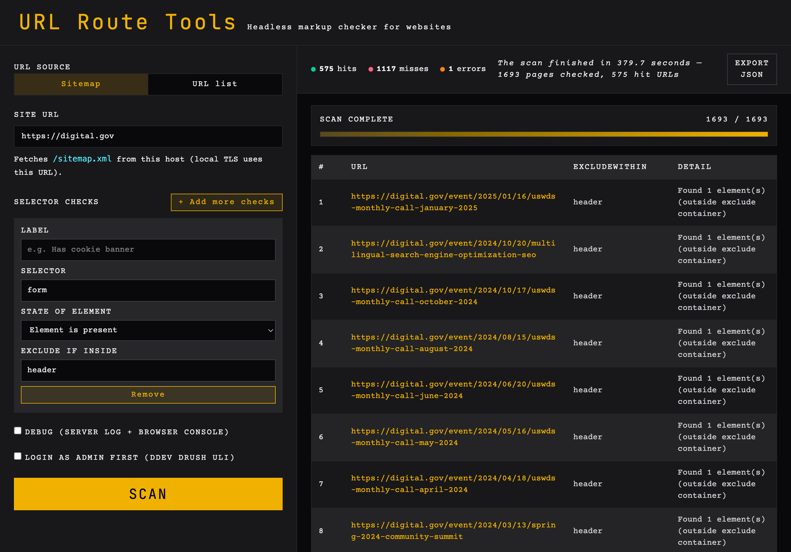

# URL Route Tools



## Introduction
URL route tools can query an xml sitemap (typically located at https://example.com/sitemap.xml) or a JSON list of URLs and check for the presence of selectors on the pages linked in the sitemap. You can also use this on a localhost site, for example, a ddev instance.

## Installation
Ensure node 24 is installed or you have nvm installed and use the .nvmrc file to set the correct node version.
```
nvm use
npx playwright install
npm i
```

Now run the server:
```
node server.js
```
You will see the url in terminal: `http://localhost:3333`

## Usage
- Choose **Sitemap** (default) or **URL list** as the URL source.
- Enter a base site URL in **Site URL** (used for sitemap fetch and local TLS; keep it aligned with your DDEV host).
- **Sitemap**: fetches `/sitemap.xml` from the site URL.
- **URL list**: paste or upload a JSON array of full URLs, e.g. `["https://example.ddev.site/page-one", "https://example.ddev.site/page-two"]`. The UI shows how many URLs loaded after parse.
- Use the various fields in the UI to configure the checks you want to run.
- The fields are:
  - Label: A label for the check. (Useful for the exported report to identify the check)
  - Selector: A selector to check for on the page. Examples:
    - `#top-level-nav`
    - `.top-banner` (class selector)
    - `.top-banner, .top-nav` (comma-separated list of selectors)
    - `form` (element selector)
    - `input[type="email"]` (attribute selector)
    - `button[type="submit"]` (attribute selector)
  - Expected: Whether the selector should be present or absent. (present, absent, contains text...)
  - Exclude if inside: A selector to exclude from the check. (e.g. `#modal` or `.flyout` or `#drawer`)
- Click the "Scan" button to start the scan.
- The results will be displayed in the UI.
- The results can be exported as a JSON file.

## Debugging
You can enable debugging by checking the "Debug" checkbox. This will log the server logs and the browser console to the terminal.

## JSON options (URL list)
This comes in handy if you do not have an XML sitemap. It presumes you have some way of querying the urls for a site. Paste or upload a JSON formatted file of URls in the format as shown below:

```json
[
  "https://example.com/",
  "https://example.com/about",
  "https://example.com/contact",
  "https://example.com/products",
  "https://example.com/products/123",
  "https://example.com/blog",
  "https://example.com/blog/my-first-post",
  "https://example.com/search?q=hello+world",
  "https://example.com/user/profile?id=42",
  "https://example.com/api/v1/items"
]
```

Note, Using the pasting JSON method, large URL lists are sent in the POST body. The default JSON limit is **25 MB** (`SITEMAP_SCAN_BODY_LIMIT_MB`). If you see **413 Payload Too Large**, restart the server with a higher value, e.g. `SITEMAP_SCAN_BODY_LIMIT_MB=50 node server.js`.

## ddev and Drupal
Use `Login as admin first (ddev drush uli)` if you are on a local ddev drupal site and you want to query URLs behind some sort of access control or login. A `ddev drush uli` command will automatically be used before the search starts.

## Roadmap
- ❌ Specify the sitemap link if it differs from the standard `site.com/sitemap.xml` path
- ✅ Determine a method to run a `ddev drush uli` command and have the app login if the site requires authentication
- ❌ Show labels for form fields (better UX)
- ❌ Make HTML placeholders more actionable
- ❌ Make Selector field its own line
- ✅ Allow for JSON upload or paste
